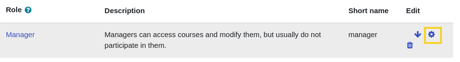
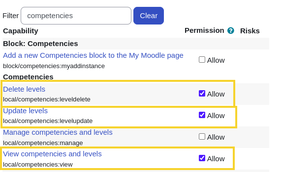
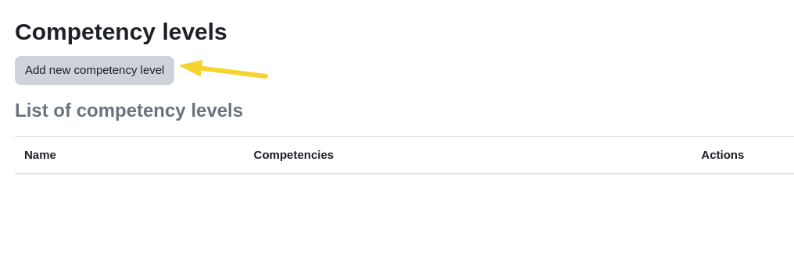
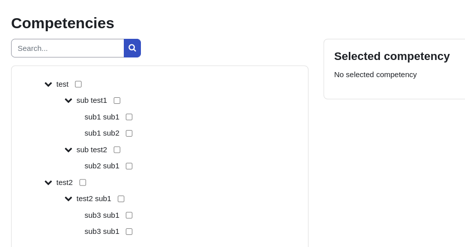
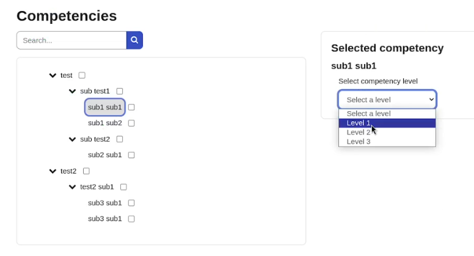
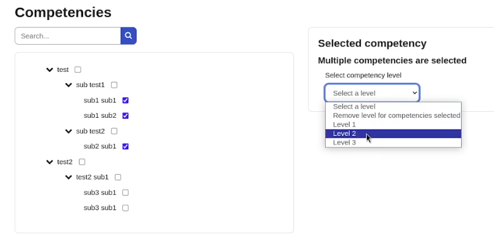
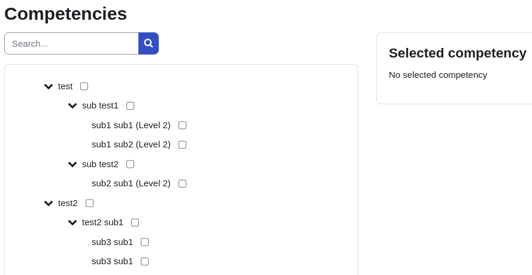
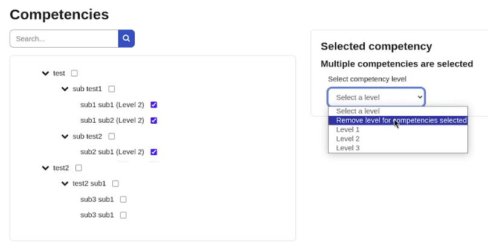

# Instrucciones

### Verificar los permisos del usurio
Acceder a:  
`Site administration > Users > Permissions > Define roles`
En las lista de usuarios seleccionar la opcion editar del usuario al cual se quiera hacer la validacion y/o asignacion de permisos:  

 

### Crear niveles para posteriormente agregarlo a las competencias

Acceder a:  
`Site administration > General > Local competencies > Competency levels`

En la vista que aparecerá dar click en el boton `Add new competency level`

Asignar un nombre al nivel y guardar cambios
 
### Asignar nivel a las competencias
Acceder a:  
`Site administration > General > Local competencies > Competencies`

Deberá salir una vista como la siguiente

Los niveles se pueden agregar de forma individual a una sola competencia

O de forma multiple seleccionando las competencias desde el check y eligiendo el nivel que se quiera agregar a todas las competencias seleccionadas

Tambien se puede remover los niveles de forma multiple, seleccionando todas las competencias que se les quiera quitar el nivel

